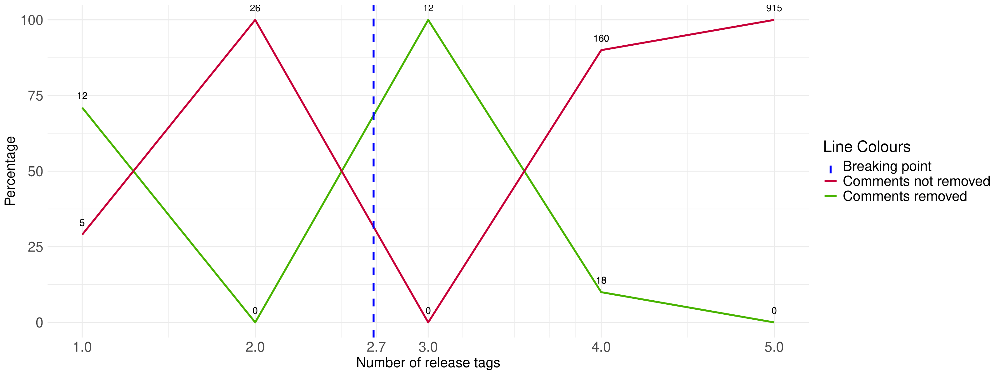

# Mining Security Indicators

This repository contains the replication package for the extended abstract *Where do developers admit their security-related concerns?*. The work was conducted by Moritz Mock, Thomas Forrer, and Barbara Russo.

_*A preprint will be made available upon receipt of acceptance.*_

## Abstract

Developers use different means to document the security concerns of their code. 
Because of all of these opportunities, they may forget where the information is stored, or others may not be aware of it, and leave it unmaintained for so long that it becomes obsolete, if not useless. 
In this work, we analyzed different sources of code documentation from four large-scale, real-world, open-source projects in an industrial setting to understand where developers report their security concerns. In particular, we manually inspected 2.559 instances taken from code comments, commit messages, and issue trackers. 
Overall, we found that developers prefer to document security concerns in source code comments and issue trackers. 
We also found that the longer the comments stay unfixed, the more likely they remain unfixed. Thus, to create awareness among developers, we implemented a pipeline to remind them about the introduction or removal of comments pointing to a security problem.




## Installation 

```
pip install -r req.txt
```

## Commands to execute the code

### Traversing commit messages

```
python traverse_commits.py --path <project> --path_logs <folder_for_the_logs>
```

### Traverse code for comments

Traverses the most recent code for security patterns.

```
python traverse_code_for_comments.py --path <project> --path_logs <folder_for_the_logs>
```

### Traverse code history for comments

Traverses the complete history of a project for security or MAT patterns.

To prepare the data for the visualization, run the second script.

```
python traverse_history_for_comments.py --path <project> --path_logs <folder_for_the_logs> --MAT <TRUE/FALSE>
python eval_historical_data.py --path <project> --path_logs <folder_for_the_logs>
```

### Extract tags of a project

```
python extract_tags_of_project.py --path <project> --path_logs <folder_for_the_logs>
```

### Traverse code tags for comments

Traverse the complete tags of a project for security or MAT patterns.

To prepare the data for the visualization run the second script.

```
python traverse_tags_for_comments.py --path <project> --path_logs <folder_for_the_logs> --MAT <TRUE/FALSE>
python eval_historical_data.py --path <project> --path_logs <folder_for_the_logs>
python include_information_about_the_number_of_tags.py --path <project> --path_logs <folder_for_the_logs>
```
